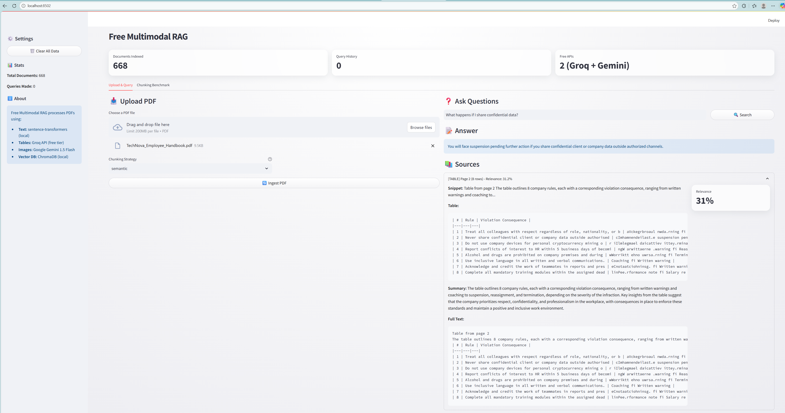

# Free Multimodal RAG

A fully free, open-source Multimodal Retrieval-Augmented Generation (RAG) system that processes PDFs and answers user queries with source attribution across three modalities: **text**, **tables**, and **images/charts**.

## 🎯 Key Features

- **Zero-Cost Architecture**: Uses only free APIs (Groq, Google Gemini) and local models (sentence-transformers, ChromaDB)
- **Three Modalities Supported**:
  - **Text** → Extracted and embedded locally with sentence-transformers
  - **Tables** → Converted to markdown, summarized with Groq Llama 3.3 70B
  - **Images/Charts** → Analyzed with Google Gemini 1.5 Flash Vision
- **Local-First**: Text embeddings run entirely offline; images/tables only call APIs during processing
- **Source Attribution**: Every answer includes source badge, snippet, and original content reference
- **Graceful Fallback**: If Groq API is unavailable, system falls back to local LLM (ollama)

## 🖼️ Application Interface



## 🏗️ Architecture

```
PDF Input
    ├─ pdfplumber → Tables → Groq Summary → ChromaDB
    ├─ PyMuPDF → Images → Gemini Vision → ChromaDB
    └─ unstructured.io → Text → sentence-transformers → ChromaDB
                                            ↓
                              Query → ChromaDB Retrieval
                                            ↓
                        Groq LLaMA 3.3 (or local fallback)
                                            ↓
                        Streamlit UI (source attribution)
```

## 📦 Tech Stack

| Component | Technology | Why? |
|-----------|-----------|------|
| **PDF Extraction** | pdfplumber + PyMuPDF | Fast, precise table & image extraction |
| **Text Chunking** | LangChain | Intelligent semantic boundaries |
| **Embeddings** | sentence-transformers (all-MiniLM-L6-v2) | Free, local, fast |
| **Vector DB** | ChromaDB | Open-source, runs fully offline |
| **Table Summarization** | Groq API (Llama 3.3 70B) | Free tier (6k tokens/min) |
| **Image Understanding** | Google Gemini 1.5 Flash | Free tier (1500 req/day), multimodal |
| **Answer Synthesis** | Groq + Local fallback | Hybrid for resilience |
| **UI** | Streamlit | Simple, interactive, fast iteration |

## 🚀 Quick Start

### Prerequisites
- Python 3.10+
- Free API keys (sign up below)

### API Keys Required

| Service | Free Tier | Sign Up |
|---------|-----------|---------|
| **Groq** | 6,000 tokens/min, unlimited requests | [console.groq.com](https://console.groq.com) |
| **Google Gemini** | 1,500 requests/day (Flash) | [aistudio.google.com](https://aistudio.google.com) |
| **HuggingFace** | Unlimited (local models) | [huggingface.co](https://huggingface.co) |

### Installation

```bash
# Clone the repository
git clone https://github.com/yourusername/free-multimodal-rag.git
cd free-multimodal-rag

# Create virtual environment
python -m venv venv
source venv/bin/activate  # On Windows: venv\Scripts\activate

# Install dependencies
pip install -r requirements.txt

# Configure API keys
cp .env.example .env
# Edit .env with your API keys
```

### Running the App

```bash
streamlit run app.py
```

Open http://localhost:8501 in your browser.

## 📋 Usage

1. **Upload a PDF** using the file uploader
2. **Ask questions** about the content
3. **View answers** with source attribution:
   - `[TEXT]` badge with text snippet
   - `[TABLE]` badge with original markdown
   - `[IMAGE]` badge with image reference

## 📊 Chunking Strategy Benchmark

The system includes a benchmark comparing three chunking strategies. Run it in the UI (Chunking Benchmark tab) to evaluate on your own documents:

| Strategy | Optimizes For | Use Case |
|----------|--------------|----------|
| **Recursive** | Semantic coherence | Default, best for most PDFs |
| **Fixed-Size** | Predictable chunks | Consistent chunk sizes needed |
| **Semantic** | Sentence boundaries | Documents with clear paragraph structure |

Run the benchmark on your PDFs to find the optimal strategy. Results saved to `results/chunking_benchmark.csv`.

## 🤝 Contributing

Contributions welcome! Please follow PEP 8 and add tests for new features.

## 📚 Learn More

- [Groq LLM Documentation](https://console.groq.com/docs)
- [Google Gemini API](https://ai.google.dev)
- [ChromaDB Vector Database](https://docs.trychroma.com)
- [Sentence Transformers](https://www.sbert.net)
- [Streamlit Documentation](https://docs.streamlit.io)
